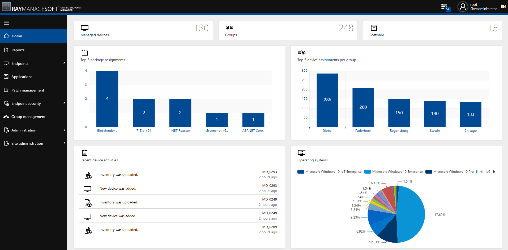

# RayManageSoft Unified Endpoint Manager
RayManageSoft Unified Endpoint Manager provides a cloud-based solution for software deployment as well as patch management and an overview over the entire IT infrastructure.
It is possible to automate the management and software deployment for huge parts of the infrastructure while at the same time, keep individual schedules and lists of optional and mandatory software for specific endpoints.

## Multi-tenancy
RayManageSoft Unified Endpoint Manager can manage a multi-tenant environment, which means that it can manage multiple tenants or multiple infrastructure environments which can be hosted by different storage hosters.

## Supported storage providers
Currently Microsoft Azure, Amazon S3, and MinIO are the storage hoster which are supported by RayManageSoft Unified Endpoint Manager.

# Installation
## Prerequisites
* Docker Images for RayManageSoft Unified Endpoint Manager.
* Docker for Windows (onsite installation)
*In order to use Docker the Hyper-V and Containers Windows features must be enabled.*
* Microsoft SQL Server.
*An instance of MS SQL Server or SQL Server Express must be available and the server must be reachable from the Docker environment.*
* A network storage solution (Azure, MinIO, or Amazon Web Services)
* A valid RayManageSoft Unified Endpoint Manager license, either in form of an order number or in form of a license file.

**Note:** RayManageSoft Unified Endpoint Manager uses Windows docker images, make sure that Docker has been switched to Windows Containers mode. It is not possible to pull the images when running Linux Containers.

## Images ##
RayManageSoft Unified Endpoint Manager images are available on docker hub:
* [`https://hub.docker.com/r/raynetgmbh/raymanagesoft-uem-backend`](https://hub.docker.com/r/raynetgmbh/raymanagesoft-uem-backend)
* [`https://hub.docker.com/r/raynetgmbh/raymanagesoft-uem-frontend`](https://hub.docker.com/r/raynetgmbh/raymanagesoft-uem-frontend)

You can use tags `2.3-windowsservercore-ltsc2019` or `stable-windowsservercore-ltsc2019` to get the last 2.3 or the last stable version respectively. You will find the complete list of tags on the respective Docker Hub page.

## Environment variables
Assuming the default setup with MinIO as a storage provider, the following environment variables are used to set-up the system:
* **SystemDb** - Connection string to the system database
* **ResultsDb** - Connection string to the database storing the tenant-specific results.
* **BackendEndpoint**, **BackendPort**, **BackendProtocol** - together they form the URL, under which your instance is available. The default settings are fine for a quick setup, but not production ready.
* **MinIOEndpoint** - your MinIO Endpoint (for example ``play.min.io:80``)
* **MinIOAccessKey** - your access key for MinIO (configured during the MinIO setup)
* **MinIOSecretKey** - your MinIO secret key (configured during the MinIO setup)
* **MinIOSSL** - a boolean value indictating whether the MinIO server requires/uses a https connection or not (the usage of an https connection is recommended).

Different environment variables are required for other supported set-up types (see installation guide for more information).

## Setting up with docker compose
1. Set-up a new MS SQL Server or use an existing MS SQL Server which is accessible from the hosting environment.
2. Create a new database on existing MS SQL Server (for example using Microsoft SQL Server Management Studio).
3. Copy connection string to your SQL Server. Ensure that the connection string is valid.
4. Install container images with ``docker compose`` with the compose file [`docker-compose.yml`](docker-compose.yml) from this repository. The compose file by default uses the configuration with MinIO for the storage. Refer to installation guide for more information about other supported setups (Azure / Amazon S3). Before creating the containers, make sure to adjuste the connection string in the compose file.

## Default docker-compose

    version: "3.7"
    services:
    
      frontend:
          image: raynetgmbh/raymanagesoft-uem-frontend:stable-windowsservercore-ltsc2019
          ports:
            - "80:80"
          restart: always
          environment:
          - SystemDb=Server=myServerAddress;Database=myDataBase;User Id=myUsername;Password=myPassword;
          - ResultDb=Server=myServerAddress;Database=myDataBase;User Id=myUsername;Password=myPassword;
          - BackendEndpoint=myServerAddress
          - BackendPort=8080
          - BackendProtocol=http
          - DefaultHoster=MinIO
          - MinIOEndpoint=play.min.io
          - MinIOAccessKey=Q3AM3UQ867SPQQA43P2F
          - MinIOSecretKey=zuf+tfteSlswRu7BJ86wekitnifILbZam1KYY3TG
          - MinIOSSL=true
    
      backend:
          image: raynetgmbh/raymanagesoft-uem-backend:stable-windowsservercore-ltsc2019
          depends_on:
          - frontend
          ports:
            - "8080:80"
          restart: always
          environment:
          - SystemDb=Server=myServerAddress;Database=myDataBase;User Id=myUsername;Password=myPassword;
          - ResultDb=Server=myServerAddress;Database=myDataBase;User Id=myUsername;Password=myPassword;

# First start #
The initial login information to the system are:
* **E-mail**: ``root@raynet.de``
* **Password**: ``raynet``

After the first login please visit the Site-Administration / System Settings page. There are a few important checks to be done:

* Ensure that the backend URL, port and protocol defined in the settings page are valid and match the parameters of the backend container. When a local installation is used, the FQDN of the backend will most likely be the same as the web UI, with the only difference in port numbers. Should there be any mismatch, make sure to adjust the values as required.
* Change the initial password of the root user to something secure, using long sequence of letters, numbers and special characters.
* Download Managed Device Client from the Devices page and install it on the computers to manage. Once the agent is started, the device will appear in the Devices tab.

**Be aware**: It may take up to 15 minutes for a machine to show up.

## License Activation ##
RayManageSoft Unified Endpoint Manager needs a valid license to run. If there is no valid license, RayManageSoft Unified Endpoint Manager will open the activation screen.

# More information

* [Raynet GmbH corporate website](https://raynet.de)
* [Raynet EALM GitHub](https://github.com/raynetEALM)
